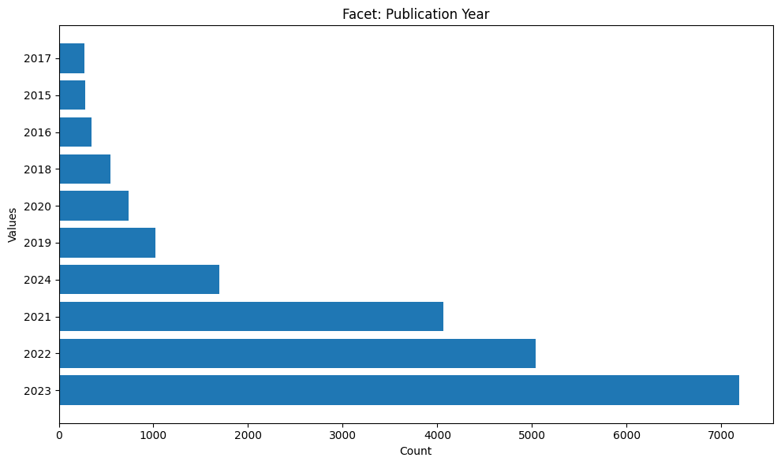
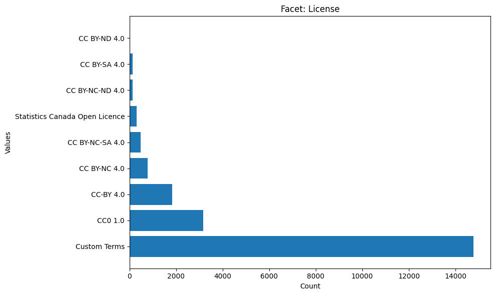
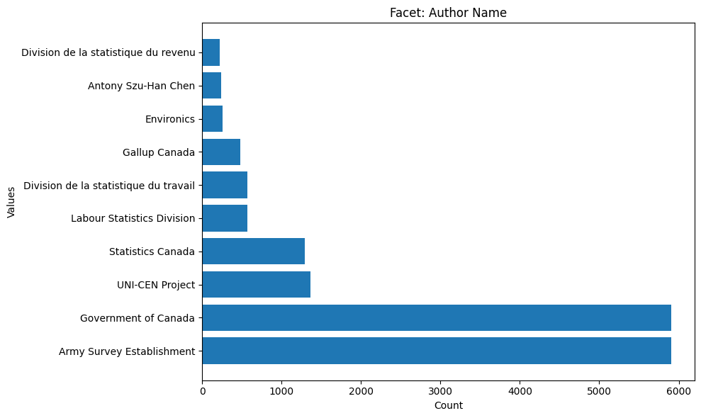
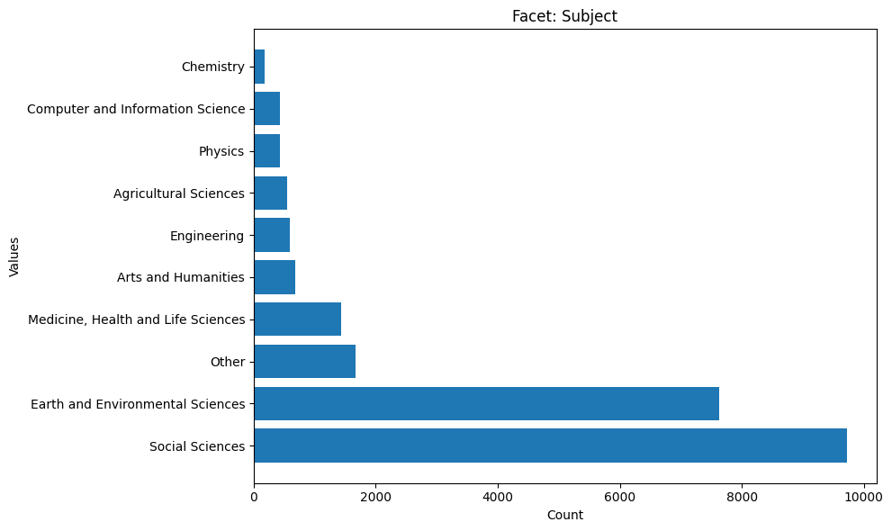
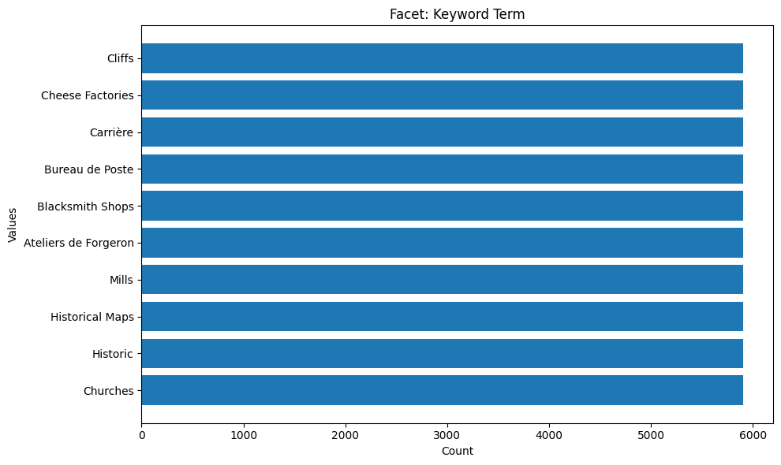
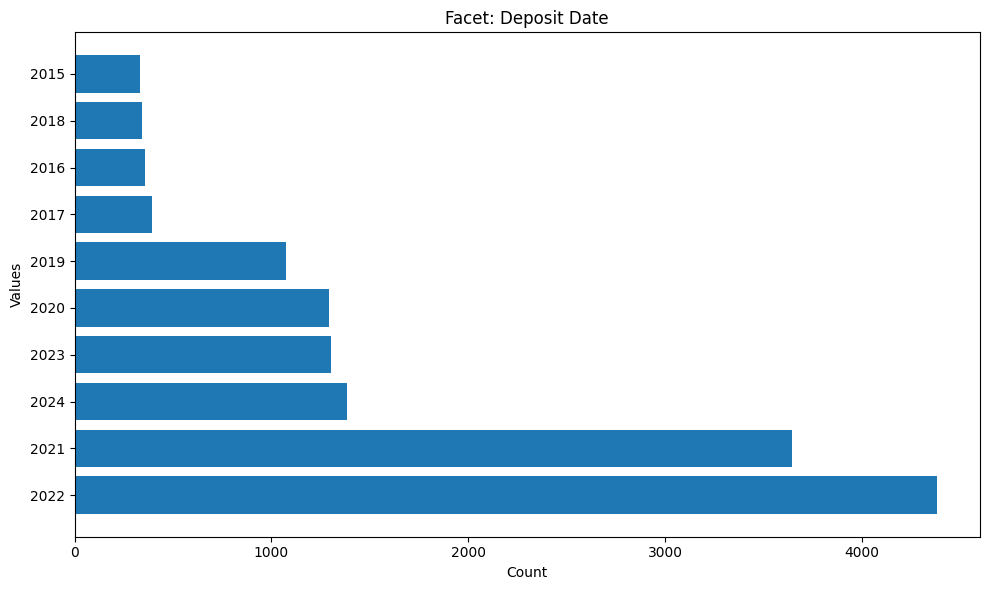

# dataverse_visualize


<!-- WARNING: THIS FILE WAS AUTOGENERATED! DO NOT EDIT! -->

This file will become your README and also the index of your
documentation.

## Developer Guide

If you are new to using `nbdev` here are some useful pointers to get you
started.

### Install dataverse_visualize in Development mode

``` sh
# make sure dataverse_visualize package is installed in development mode
$ pip install -e .

# make changes under nbs/ directory
# ...

# compile to have changes apply to dataverse_visualize
$ nbdev_prepare
```

## Usage

### Installation

Install latest from the GitHub
[repository](https://github.com/nakamura196/dataverse_visualize):

``` sh
$ pip install git+https://github.com/nakamura196/dataverse_visualize.git
```

or from [conda](https://anaconda.org/nakamura196/dataverse_visualize)

``` sh
$ conda install -c nakamura196 dataverse_visualize
```

or from [pypi](https://pypi.org/project/dataverse_visualize/)

``` sh
$ pip install dataverse_visualize
```

### Documentation

Documentation can be found hosted on this GitHub
[repository](https://github.com/nakamura196/dataverse_visualize)’s
[pages](https://nakamura196.github.io/dataverse_visualize/).
Additionally you can find package manager specific guidelines on
[conda](https://anaconda.org/nakamura196/dataverse_visualize) and
[pypi](https://pypi.org/project/dataverse_visualize/) respectively.

## How to use

Fill me in please! Don’t forget code examples:

``` python
from dataverse_visualize.core import CoreClient

url = "https://borealisdata.ca"

client = CoreClient(url)

client.visualize_data()
```












